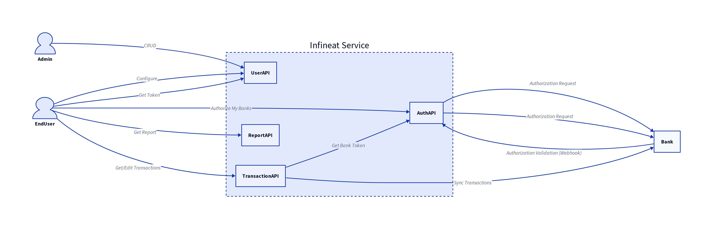
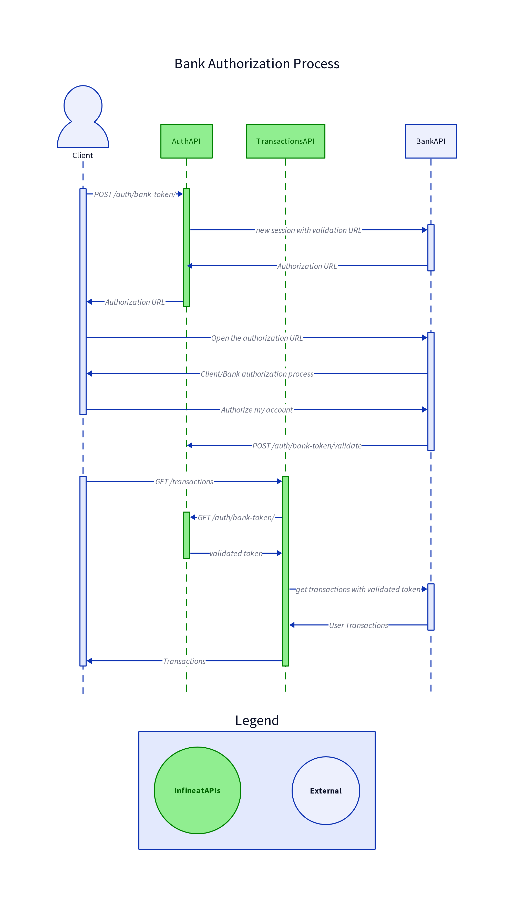
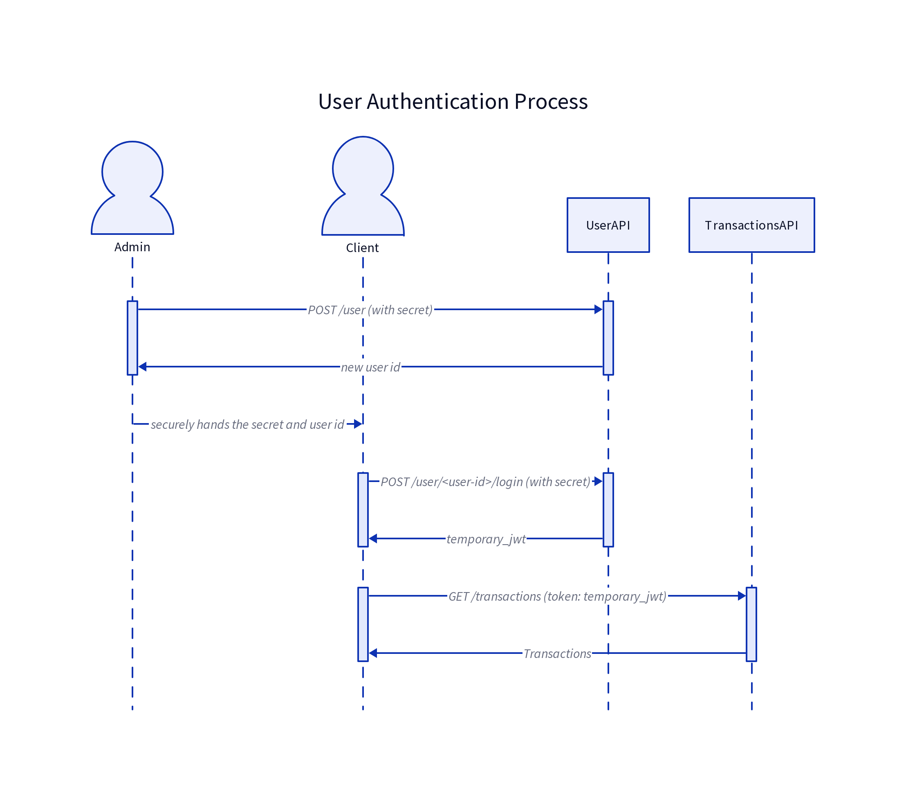

# High Level Design

Infineat is a software product comprised focused on providing clean and
meaningful financial data to its users. It focuses on personal and
family use cases, but can be extended for broader commercial use cases.

The diagram below illustrates in high level the four microservices
composing infineat's software:

  - **UserAPI**: Responsible for user management, both access and
    configuration/preferences. Note that only Admins can create or
    modify users.
  - **AuthAPI**: A key microservice to interface with banks and bank
    data providers. It manages bank accesses given by users and used by
    other internal microservices that access bank data.
  - **TransactionsAPI** Two key features of the TransactionsAPI are,
    first an adapter normalizing transactions among many different
    transactions format, from potentially many different bank data
    providers, today only GoCardless. Second, a couple of transactions
    cleaning features such as detection of internal transactions,
    deduplication, making data infinitely neat.
  - **ReportsAPI**: Basic aggregation reporting capabilities such as
    expense, income, balance per selected period. There's also
    categorization through user configuration, or through transaction
    similarity metrics.

# AuthAPI

The **AuthAPI** is key to a successful integration with banks. It
manages user consent to bank accesses, validates and securely stores
bank tokens. A sequence diagram below illustrates the interactions
between Client, TransactionAPI with AuthAPI.

Fore more detailed AuthAPI specification please visit:
<https://github.com/in-fin-neat/in-fin-neat-api/blob/main/models/auth.smithy>

# UserAPI

The **UserAPI** is a lightweight access service that enables
multitenancy in the infineat app. A sequence diagram for the user
creation and token generation is described below.

