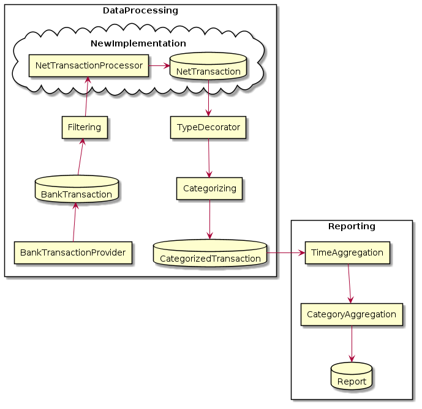
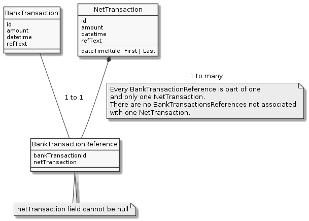

# High Level Processing Steps

# Net Transactions (to be implemented)

The idea of net transactions is to group \`BankTransaction\` into a new
resource called \`NetTransaction\`, so that multiple
\`BankTransactions\` can be treated as a single atomic transaction by
further processing features. This is specially useful for a couple of
use cases:

1.  **Purchase-Refund**: Online of physical purchases sometimes are
    wrongly made and they can be entirely or partially refunded. These
    are reflected as multiple bank transactions adding noise to
    analysis, specially if these transactions are split across
    categories or different time periods. A single \`NetTransaction\`
    with the net amount of the purchase after refund, can provide
    cleaner analysis and understanding of the data.
2.  **Bill-Sharing**: Similar to refunds, sometimes bills are split
    among multple people and a single person pays the total amount,
    afterwards other people transfer a partial amount to the payer.
    \`NetTransaction\`s in this case offer a significant cleaner view of
    the data here.

## Concept and modelling

`NetTransactions` should be compatible with `BankTransactions` so that
all further processing layers can transparently process both
inter-changeably. `NetTransactions` can be viewed as a set partition of
the set of all `BankTransactions`, so that every `BankTransaction` is
associated with one, and only one, `NetTransaction`.

